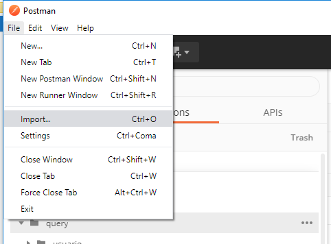

# Spring-Boot con GraphQL

Componentes de Servidor GraphQL

- docker
- java 8
- Spring Boot 2.2.7
- graphql-spring-boot-starter 
- spring-boot-starter-data-jpa
- graphql-java-tools
- postgresql
- lombok

## Arquitectura


## Como levantar la aplicacion

nota: Para el desarrollo se utilizo Sistema Operativo macOS High Sierra v10.13.6

primero que nada hay que tener docker y java 8 instalado. Se utilizaron las siguientes versiones para el desarrollo:

- Docker version 19.03.8
- java version "1.8.0_91"

si usa window realizar swtich to linux container. Los siguientes comandos se ejecutan en la carpeta ApiGraphQL.


Crear volumen postgres.

```bash
docker volume create --name=postgres
```

hay que crear la instacias postgres BD y pgadmin4:

```bash
docker-compose up -d 
```
verificar que los contenedores se crearon correctamente:

```bash
docker-compose ps
```
para verificar la network de docker ejecutar el siguiente comando:

```bash
docker network inspect api-usuario_api-usuario
```


para abrir la interfaz PGAdmin:

- http://localhost:80

credenciales:

```bash
usuario: rafael.ortiz.barrera@gmail.com
password: 123456
```

Cree una conexion en pgAdmin


credenciales base de datos:

```bash
usuario: apiusuario
bd: apiusuario
password: 123456
```
Poner ip en la opcion de host:


Otra opcion es entrar por CLI, con el siguiente comando:

```bash
psql apiusuario apiusuario -h 0.0.0.0
```

Compilar proyecto 

```bash
mvn clean package
```

Una vez creado el scheme comentar la siguiente linea 

```bash
spring.datasource.initialization-mode=always
```

Levantar Spring-Boot

```bash
java -jar target/graphql-1.0.0.jar
```

cuando la aplicacion ya se este ejecutando puede exportar en la aplicacion postman el archivo .json en la carpeta postman



